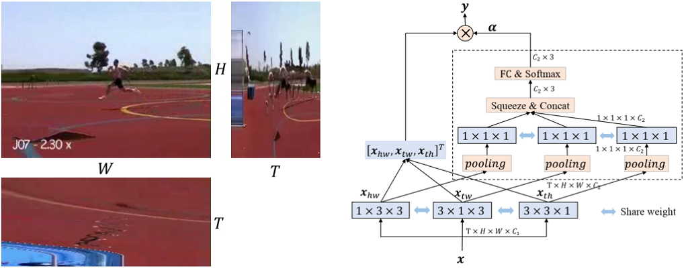

Collaborative Spatiotemporal Feature Learning for Video Action Recognition
==========================================================================



This repository provides the official code for the CVPR'19 paper [Collaborative Spatiotemporal Feature Learning for Video Action Recognition](https://openaccess.thecvf.com/content_CVPR_2019/papers/Li_Collaborative_Spatiotemporal_Feature_Learning_for_Video_Action_Recognition_CVPR_2019_paper.pdf). The models introduced in the paper were initially implemented in TensorFlow. Here we refactor the code in PyTorch based on the [MMAction2](https://github.com/open-mmlab/mmaction2/) framework.

## Installation

Follow the instruction below to setup a valid Python environment.

```shell
conda create -n cost python=3.9 -y
conda activate cost
conda install pytorch=1.12.0 torchvision=0.13.0 cudatoolkit=11.3 -c pytorch -y
pip install mmcv-full==1.6.1 -f https://download.openmmlab.com/mmcv/dist/cu113/torch1.12.0/index.html
pip install mmaction2==0.24.1
```

## Getting Started

### Data Preparation

Use the scripts in [tools/data](tools/data) to download and setup the Kinetics-400 and Moments in Time datasets. In our experiments, we download the Kinetics-400 dataset from [cvdfoundation/kinetics-dataset](https://github.com/cvdfoundation/kinetics-dataset). After filtering corrupted videos, we get 241,181 videos for training and 19,877 videos for validation. For Moments in Time, we use the v1 version with 802,244 training videos and 33,900 validation videos from 339 categories. Put the datasets in `data/` with the following structure.

```
data
├── kinetics400
│   ├── annotations
│   │   ├── kinetics_test.csv
│   │   ├── kinetics_train.csv
│   │   └── kinetics_val.csv
│   ├── kinetics400_train_list_videos.txt
│   ├── kinetics400_val_list_videos.txt
│   ├── videos_train
│   └── videos_val
└── mit
    ├── annotations
    │   ├── license.txt
    │   ├── moments_categories.txt
    │   ├── README.txt
    │   ├── trainingSet.csv
    │   └── validationSet.csv
    ├── mit_train_list_videos.txt
    ├── mit_val_list_videos.txt
    └── videos
        ├── training
        └── validation
```

### Train

You can use the following command to train a model.

```shell
./tools/run.sh ${CONFIG_FILE} ${GPU_IDS} ${SEED}
```

Example: train the CoST(b) model on Moments in Time using 8 GPUs with seed 0.

```shell
./tools/run.sh configs/cost/costb_r50_8x8x1_48e_mit_rgb.py 0,1,2,3,4,5,6,7 0
```

### Test

You can use the following command to test a model.

```shell
tools/dist_test.sh ${CONFIG_FILE} ${CHECKPOINT_FILE} ${NUM_GPUS} [optional arguments]
```

Example: test the CoST(b) model on Moments in Time using 4 GPUs.

```shell
./tools/dist_test.sh configs/cost/costb_r50_8x8x1_48e_mit_rgb.py \
    work_dirs/costb_r50_8x8x1_48e_mit_rgb/best_top1_acc_epoch_48.pth \
    4 --eval top_k_accuracy
```

## Performance

All the following models are trained using 8 RTX 3090 GPUs with a seed of 0. We report top1/top5 accuracies on the validation set of Kinetics-400 and Moments in Time. The 1-clip and 10-clip settings refer to the `val_pipelines` and `test_pipeline` in the configuration files respectively. Note that we achieve higher accuracy on Moments in Time and lower accuracy on Kinetics-400, which may be due to the minor difference in implementation details (e.g. video preprocessing).

### Kinetics-400

| Method | Backbone | Config | Input Size | Our Acc (1 clip) | Our Acc (10 clips) | Paper Acc (10 clips) |
|--------|----------|--------|------------|------------------|--------------------|----------------------|
| C2D | ResNet-50 | [c2d_r50_8x8x1_160e_kinetics400_rgb.py](configs/c2d/c2d_r50_8x8x1_160e_kinetics400_rgb.py) | 8x224x224 | 66.03/85.63 | 72.28/89.99 | 71.5/89.8 |
| I3D<sup>1</sup> | ResNet-50 | [i3d_r50_8x8x1_160e_kinetics400_rgb.py](configs/i3d/i3d_r50_8x8x1_160e_kinetics400_rgb.py) | 8x224x224 | 66.86/86.17 | 73.40/90.91 | 73.3/90.4 |
| CoST(a) | ResNet-50 | [costa_r50_8x8x1_160e_kinetics400_rgb.py](configs/cost/costa_r50_8x8x1_160e_kinetics400_rgb.py) | 8x224x224 | 66.20/86.13 | 72.89/90.46 | 73.6/90.8 |
| CoST(b) | ResNet-50 | [costb_r50_8x8x1_160e_kinetics400_rgb.py](configs/cost/costb_r50_8x8x1_160e_kinetics400_rgb.py) | 8x224x224 | 66.90/86.25 | 73.85/90.98 | 74.1/91.2 |

### Moments in Time

| Method | Backbone | Config | Input Size | Our Acc (1 clip) | Our Acc (10 clips) | Paper Acc (10 clips) |
|--------|----------|--------|------------|------------------|--------------------|----------------------|
| C2D | ResNet-50 | [c2d_r50_8x8x1_48e_mit_rgb.py](configs/c2d/c2d_r50_8x8x1_48e_mit_rgb.py) | 8x224x224 | 28.21/54.65 | 30.17/56.75 | 27.9/54.6 |
| I3D<sup>1</sup> | ResNet-50 | [i3d_r50_8x8x1_48e_mit_rgb.py](configs/i3d/i3d_r50_8x8x1_48e_mit_rgb.py) | 8x224x224 | 29.27/56.13 | 31.04/58.28 | 29.0/55.3 |
| CoST(a) | ResNet-50 | [costa_r50_8x8x1_48e_mit_rgb.py](configs/cost/costa_r50_8x8x1_48e_mit_rgb.py) | 8x224x224 | 29.10/55.73 | 30.80/57.94 | 29.3/55.8 |
| CoST(b) | ResNet-50 | [costb_r50_8x8x1_48e_mit_rgb.py](configs/cost/costb_r50_8x8x1_48e_mit_rgb.py) | 8x224x224 | 30.23/57.41 | 32.23/59.84 | 30.1/57.2 |

<sup>1</sup> The C3D model described in the paper is essentially a variant of I3D.

## License

This project is released under the [Apache 2.0 license](LICENSE). The scripts in [tools](tools) are adapted from [MMAction2](https://github.com/open-mmlab/mmaction2/) and follow the original license.

## Citation

```BibTeX
@inproceedings{li2019collaborative,
  title={Collaborative Spatiotemporal Feature Learning for Video Action Recognition},
  author={Li, Chao and Zhong, Qiaoyong and Xie, Di and Pu, Shiliang},
  booktitle={Proceedings of the IEEE/CVF Conference on Computer Vision and Pattern Recognition},
  pages={7872--7881},
  year={2019}
}
```

## Acknowledgement

CoST is built upon [MMAction2](https://github.com/open-mmlab/mmaction2/). We appreciate all contributors to the excellent framework.
